# Ticket Tango

# Team Members
* [Myo Myat Min](https://github.com/MyoMyatMin)
* [Ye Myat Moe](https://github.com/YeMyat144)
* [Han Htet Aung](https://github.com/hanhtetaung)

# Project Description
Ticket Tango is an online system for booking cinema tickets, aimed at simplifying the process of browsing, selecting, and purchasing tickets. It eliminates the need for in-person bookings or complicated third-party services by providing a user-friendly web application that allows users to easily access movie listings, choose showtimes, and reserve seats. The application consists of two primary interfaces: an admin dashboard and a user interface.

URL - https://ticket-tango.vercel.app/

YouTube Demo - [YouTube Demo](https://www.youtube.com/watch?v=HkhgxPOYAtg)

## Admin Features
* Manage theatres (create, edit, delete) if not linked to any showtime.
* Manage movies (create, edit, delete) if not linked to any showtime.
* Manage showtimes (create, edit, delete) for movies.
* Manage Movies: Add, update, or delete movies in the system.

**Note** The passcode is simply "passcode". This is set as the default value.

## User Features
* View current and upcoming movies with showtimes
* Book tickets by selecting a movie, time, and date

## Technology Stack
* Next.js: For server-side rendering and dynamic routing, enhancing performance and SEO.
* React/MUI: For building a responsive and interactive user interface.
* MongoDB: A NoSQL database for flexible data management and efficient querying.
* Vercel: For seamless deployment and optimized performance.

## UML Diagram
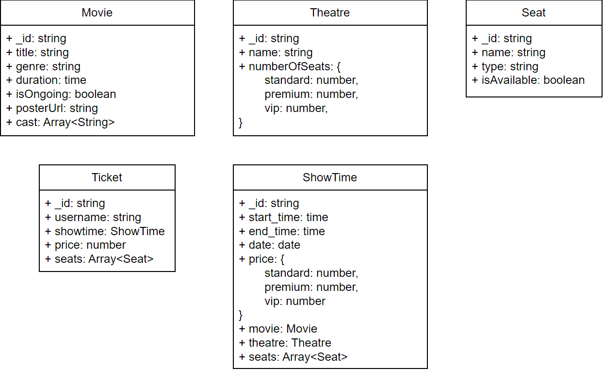

# ScreenShots

## User View

### Home Page
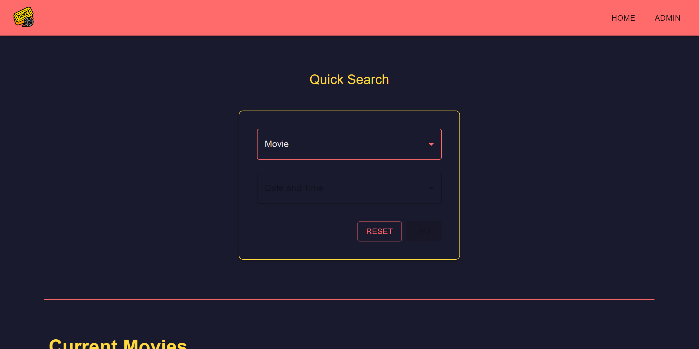
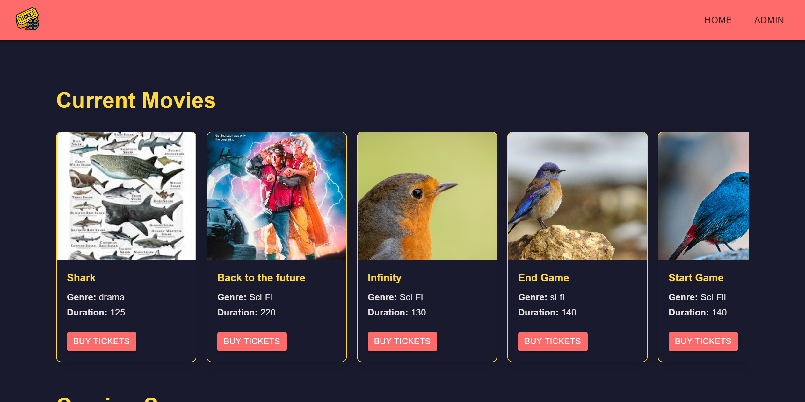
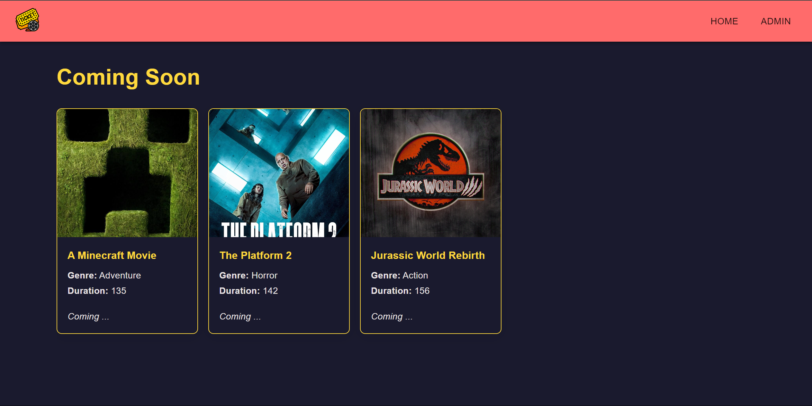

### Booking Page
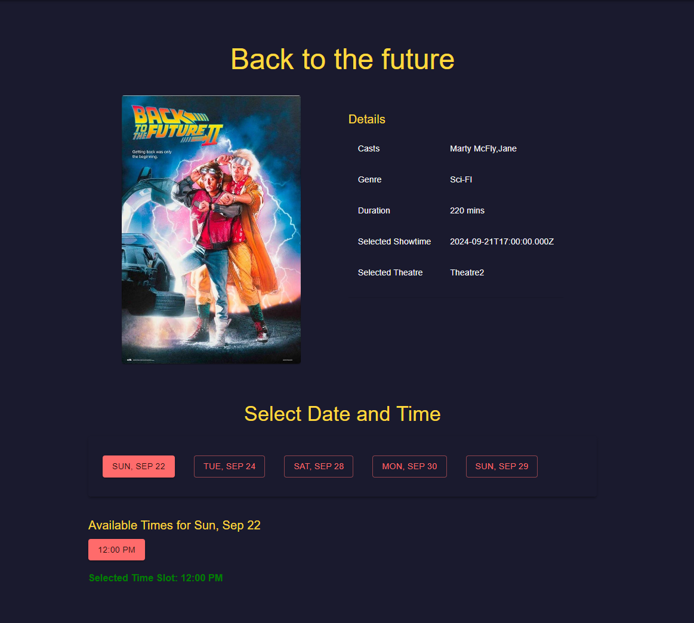
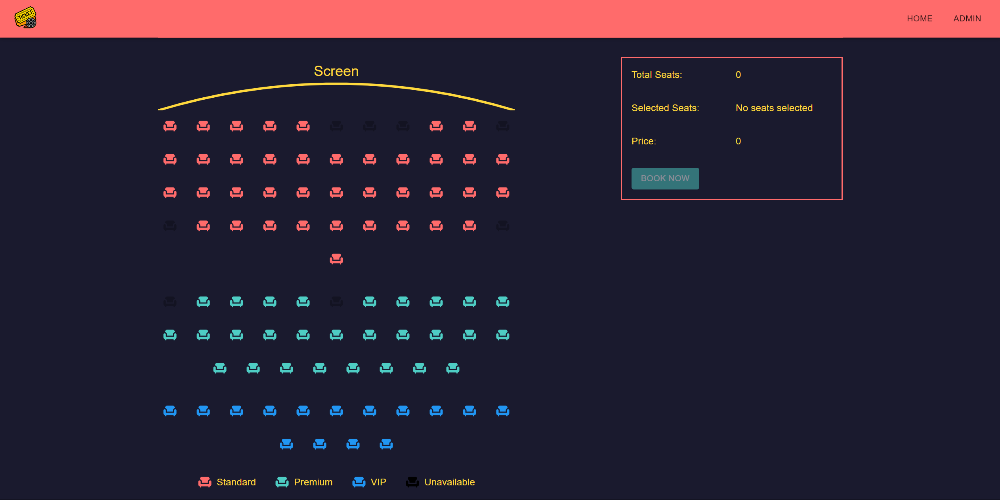

### Ticket Page
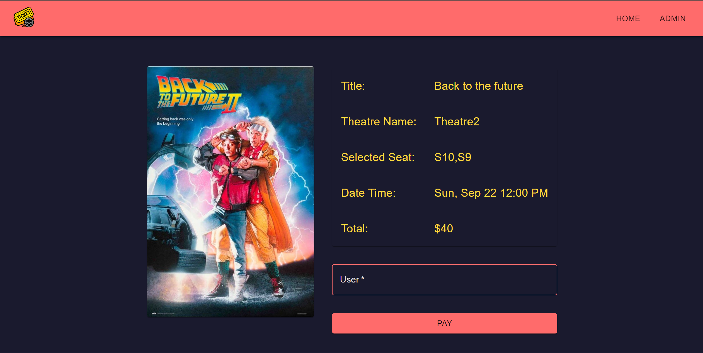

## Admin View

### Login Page
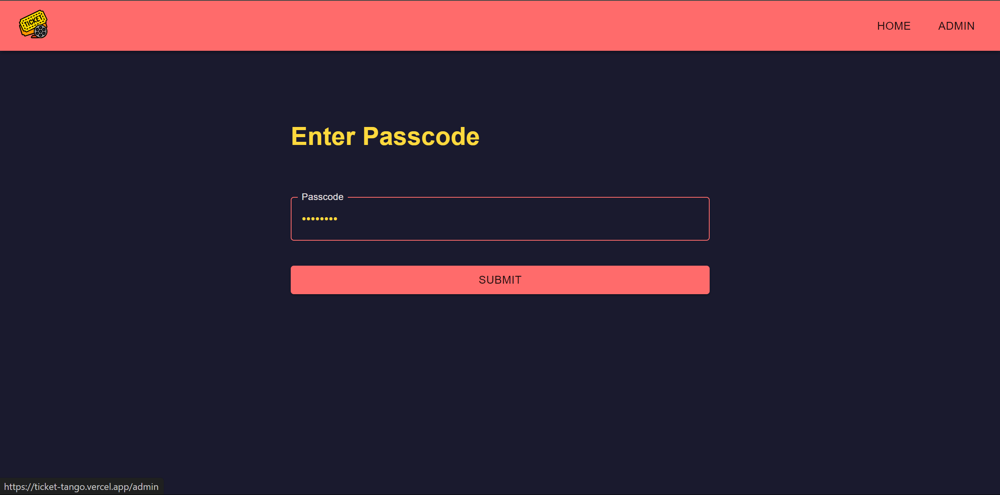

### Movie Management Page
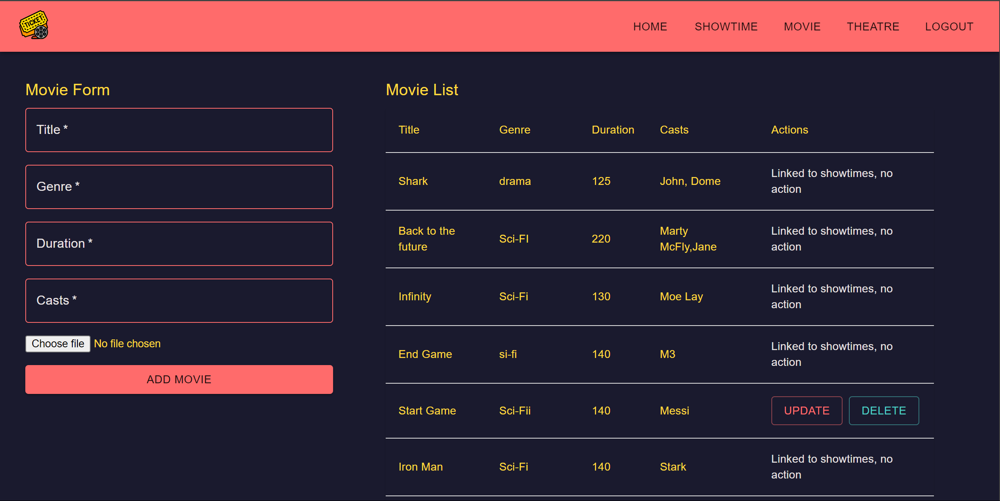

### Theatre Management Page
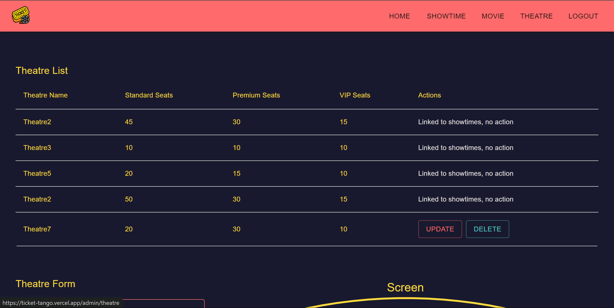
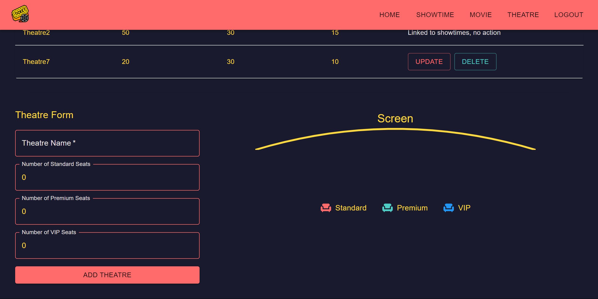
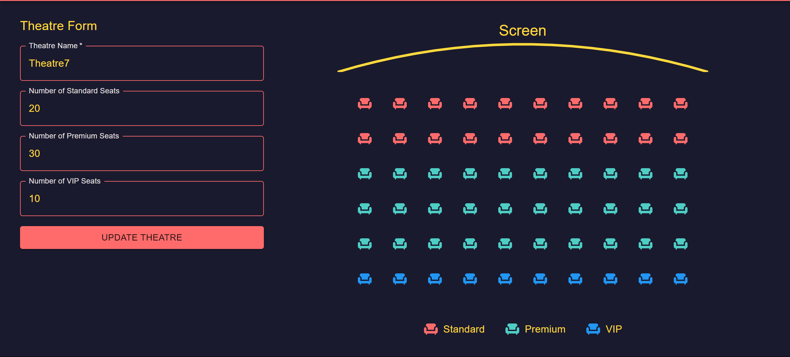

### ShowTime Management Page
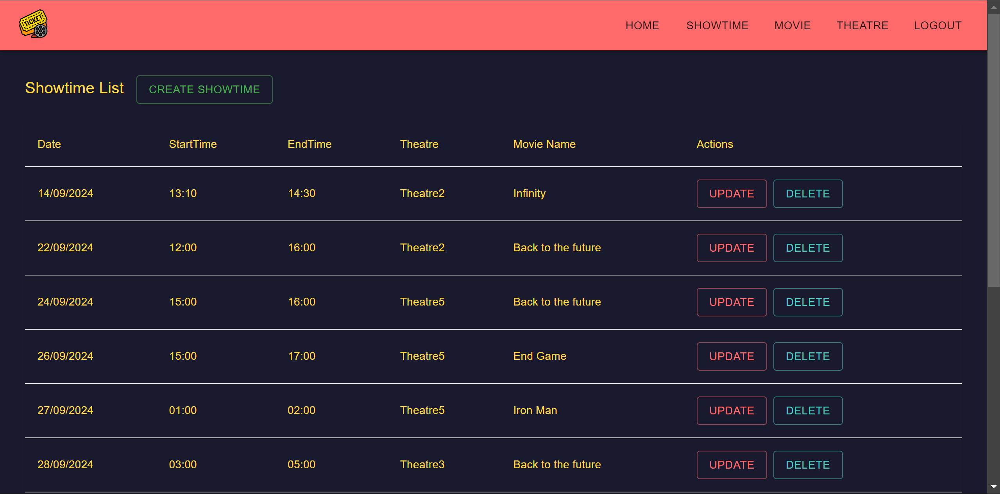
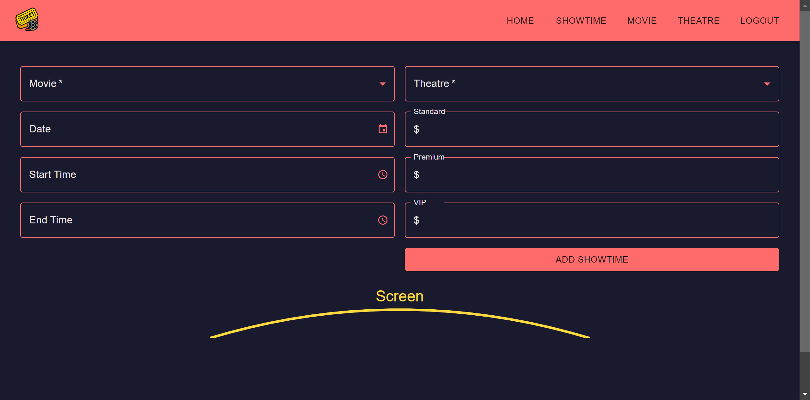
